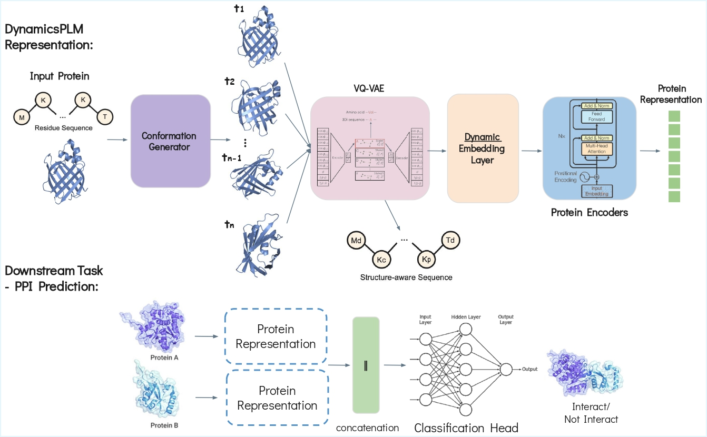

# DynamicsPLM: Learning Protein Representations with Conformational Dynamics
## Dan Kalifa, Eric Horvitz and Kira Radinsky

The repository is the official implementation of the paper: "Learning Protein Representations with Conformational Dynamics".
The paper is under review for the Nature journal.

## DynamicsPLM - Overview


Some code was borrowed from [SaProt](https://github.com/westlake-repl/SaProt) repository, which is our base PLM used by DynamicsPLM. 

## Environment installation
### Create a virtual environment
```
conda create -n DynamicsPLM python=3.10
conda activate DynamicsPLM
```
### Install packages
```
bash environment.sh  
```

## Prepare the DynamicsPLM model
### Encoders checkpoints
The encoder weights are available in [SaProt_650M_AF2](https://huggingface.co/westlake-repl/SaProt_650M_AF2) model.
After downloading, place these files in the appropriate `weights/PLMs/SaProt_650M_AF2` path.
Then, in the configs files, we will upload it using the `config_path: weights/PLMs/SaProt_650M_AF2` keyword.

### Experimental results
Some experimental results are listed below. For more details, please refer to our paper. For the fine-tuning tasks, the datasets were split based on 30% sequence identity.

## Prepare dataset
### Downstream tasks
We provide the dynamics datasets that are used in the paper. Datasets can be downloaded from 
[here???](???).
Once downloaded, the datasets need to be decompressed and placed in the `LMDB` folder for supervised fine-tuning.

We provide option to create the datasets from scratch by downloaded the statics datasets from 
[here](https://drive.google.com/drive/folders/11dNGqPYfLE3M-Mbh4U7IQpuHxJpuRr4g?usp=sharing), and then following the `main.py` to create the dynamics datasets.
We use the conformation generator from [RocketSHP](https://github.com/samsledje/RocketSHP/tree/main).

#### Fair evaluation 
We provide the full benchmark datasets. For each benchmark task, especially new ones, to ensure fair and rigorous evaluation, users must remove any sequence from the pre-training set that exhibits >30% Needleman–Wunsch (NW) similarity to any test sequence before training.

## Encoders and pre-trained embeddings
To train the SaProt model (the base encoders), you need the pre-training dataset, which can be downloaded from
[here](https://huggingface.co/datasets/westlake-repl/AF2_UniRef50).

## Conformation Generator
To train the conformation generator, follow the instruction [here](https://github.com/samsledje/RocketSHP/tree/main).
This model use ESM-3 model for the structure predictions, therefore you shoule gain access to this model following instructions:

🔐 Where do you get your token for the model?
Go to: https://huggingface.co/settings/tokens
Then, in your env enter: `huggingface-cli login`


## Train & Fine-tune DynamicsPLM
We provide a script to training and fine-tuning DynamicsPLM on the benchmark datasets. The following code shows how to fine-tune DynamicsPLM on specific
downstream tasks. Before running the code, please make sure that the datasets are placed in the `LMDB` folder and the
pre-trained weights are placed in the `weights/` folder.
**Note that the default training setting is not the same as in the paper because of the hardware limitation for different users. We recommend that users modify the YAML file flexibly based on their conditions (i.e., batch_size, devices, and accumulate_grad_batches).**

```
# Fine-tune ProtLigand on the HumanPPI task
python scripts/training.py -c config/HumanPPI/dynamic_plm.yaml
```


## Test DynamicsPLM on the dynamics subsets of proteins
To test the DynamicsPLM on the dynamic subset of proteins, you can use the `clean_clusters_codnasQ.csv` file to gets the proteins which meets the dynamics criteria.
Then, to create a dynamic_test folder and to test the model using the following command:

```
Testing the DynamicsPLM on the DeepLoc (Subcellular) task, on the dynamics proteins only
python scripts/training.py -c config/DeepLoc/cls10/dynamic_only.yaml
```


### Record the training process (optional)
If you want to record the training process using wandb, you could modify the config file and set `Trainer.logger = True`, and then paste your wandb API key in the config key `setting.os_environ.WANDB_API_KEY`.


## DynamicsPLM Usages

### Convert protein structure into structure-aware sequence
We provide a function to convert a protein structure into a structure-aware sequence. The function calls the 
[foldseek](https://github.com/steineggerlab/foldseek) 
binary file to encode the structure. You can download the binary file from [here](https://drive.google.com/file/d/1B_9t3n_nlj8Y3Kpc_mMjtMdY0OPYa7Re/view?usp=sharing) and place it in the `bin` folder
. The following code shows how to use it.
```python
from utils.foldseek_util import get_struc_seq
pdb_path = "example/8ac8.cif"

# Extract the "A" chain from the pdb file and encode it into a struc_seq
# pLDDT is used to mask low-confidence regions if "plddt_mask" is True. Please set it to True when
# use AF2 structures for best performance.
parsed_seqs = get_struc_seq("bin/foldseek", pdb_path, ["A"], plddt_mask=False)["A"]
seq, foldseek_seq, combined_seq = parsed_seqs

print(f"seq: {seq}")
print(f"foldseek_seq: {foldseek_seq}")
print(f"combined_seq: {combined_seq}")
```

### Citation
If you find this repository useful, please cite our paper.
